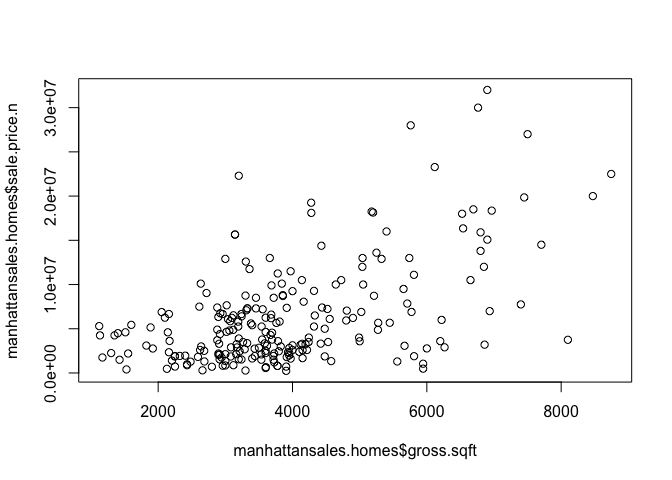
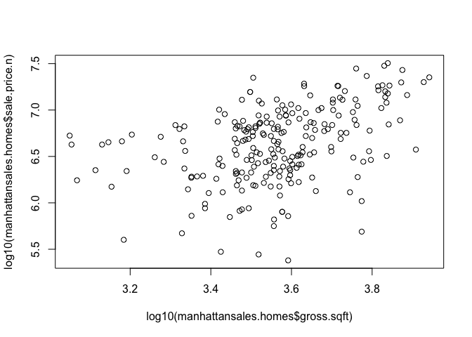

# ManhattanSalesAnalysis
Oscar Padilla  
June 6, 2016  


#MANHATTAN HOUSING DATA ANALYSIS

*CODE Extracted from: O'Neil, Cathy; Schutt, Rachel (2013-10-09). Doing Data Science: Straight Talk from the Frontline*

It requires the packages gdata and plyr


```r
require(plyr)
```

```
## Loading required package: plyr
```

```r
require(gdata)
```

```
## Loading required package: gdata
```

```
## gdata: read.xls support for 'XLS' (Excel 97-2004) files ENABLED.
```

```
## 
```

```
## gdata: read.xls support for 'XLSX' (Excel 2007+) files ENABLED.
```

```
## 
## Attaching package: 'gdata'
```

```
## The following object is masked from 'package:stats':
## 
##     nobs
```

```
## The following object is masked from 'package:utils':
## 
##     object.size
```

```
## The following object is masked from 'package:base':
## 
##     startsWith
```

```r
library(plyr)
library(gdata)
```

Now we will be reading the Excel file downloaded from [The Official Website of the City of New York](http://www1.nyc.gov/home/search/index.page?search-terms=Rolling+sales+update)


```r
manhattansales <- read.xls("Data/rollingsales_manhattan.xls", pattern ="BOROUGH")
str(manhattansales)
```

```
## 'data.frame':	23412 obs. of  21 variables:
##  $ BOROUGH                       : int  1 1 1 1 1 1 1 1 1 1 ...
##  $ NEIGHBORHOOD                  : Factor w/ 39 levels "ALPHABET CITY            ",..: 1 1 1 1 1 1 1 1 1 1 ...
##  $ BUILDING.CLASS.CATEGORY       : Factor w/ 42 levels "01  ONE FAMILY DWELLINGS                    ",..: 3 3 4 5 5 5 5 5 5 5 ...
##  $ TAX.CLASS.AT.PRESENT          : Factor w/ 8 levels "1","1A","1C",..: 1 1 3 6 6 4 4 4 4 4 ...
##  $ BLOCK                         : int  376 377 399 373 373 377 377 385 387 387 ...
##  $ LOT                           : int  24 66 1101 16 17 2 2 2 119 119 ...
##  $ EASE.MENT                     : logi  NA NA NA NA NA NA ...
##  $ BUILDING.CLASS.AT.PRESENT     : Factor w/ 123 levels "A1","A4","A5",..: 10 10 92 11 11 17 17 17 17 17 ...
##  $ ADDRESS                       : Factor w/ 12053 levels "1 5TH AVENUE, 11F/G                      ",..: 5794 5235 5071 7252 7266 738 738 4094 10861 10861 ...
##  $ APARTMENT.NUMBER              : Factor w/ 2758 levels "            ",..: 1 1 2 1 1 1 1 1 1 1 ...
##  $ ZIP.CODE                      : int  10009 10009 10009 10009 10009 10009 10009 10009 10009 10009 ...
##  $ RESIDENTIAL.UNITS             : int  3 3 1 10 10 22 22 12 22 22 ...
##  $ COMMERCIAL.UNITS              : int  0 0 0 0 0 3 3 4 2 2 ...
##  $ TOTAL.UNITS                   : int  3 3 1 10 10 25 25 16 24 24 ...
##  $ LAND.SQUARE.FEET              : int  2059 2381 0 2204 2204 4510 4510 4186 3445 3445 ...
##  $ GROSS.SQUARE.FEET             : int  3696 3084 0 8625 8625 19830 19830 10588 13546 13546 ...
##  $ YEAR.BUILT                    : int  1900 1899 1955 1899 1900 1900 1900 1900 1920 1920 ...
##  $ TAX.CLASS.AT.TIME.OF.SALE     : int  1 1 1 2 2 2 2 2 2 2 ...
##  $ BUILDING.CLASS.AT.TIME.OF.SALE: Factor w/ 123 levels "A1","A4","A5",..: 10 10 92 11 11 17 17 17 17 17 ...
##  $ SALE.PRICE                    : Factor w/ 6619 levels "$ 0","$ 1","$ 1,000",..: 2989 2312 5042 2357 1 1579 1 1 1160 1 ...
##  $ SALE.DATE                     : Factor w/ 339 levels "2015-05-01","2015-05-02",..: 172 53 45 198 198 130 130 300 220 220 ...
```

##Data Cleansing

Clean and format the data with regular expressions


```r
#convert variable SALE.PRICE from factor into numeric and get rid off of leading digits
manhattansales$SALE.PRICE.N <- as.numeric(gsub("[^[:digit:]]","", manhattansales$SALE.PRICE))
#make all variable names lower case
names(manhattansales) <- tolower(names(manhattansales))
#convert other numeric variables, as well as, date variables
manhattansales $ gross.sqft <- as.numeric(gsub("[^[:digit:]]","", manhattansales $ gross.square.feet))
manhattansales$land.sqft <- as.numeric(gsub("[^[:digit:]]","", manhattansales $ land.square.feet))
manhattansales$sale.date <- as.Date(manhattansales$sale.date)
manhattansales$year.built <- as.numeric(as.character(manhattansales$year.built))
str(manhattansales)
```

```
## 'data.frame':	23412 obs. of  24 variables:
##  $ borough                       : int  1 1 1 1 1 1 1 1 1 1 ...
##  $ neighborhood                  : Factor w/ 39 levels "ALPHABET CITY            ",..: 1 1 1 1 1 1 1 1 1 1 ...
##  $ building.class.category       : Factor w/ 42 levels "01  ONE FAMILY DWELLINGS                    ",..: 3 3 4 5 5 5 5 5 5 5 ...
##  $ tax.class.at.present          : Factor w/ 8 levels "1","1A","1C",..: 1 1 3 6 6 4 4 4 4 4 ...
##  $ block                         : int  376 377 399 373 373 377 377 385 387 387 ...
##  $ lot                           : int  24 66 1101 16 17 2 2 2 119 119 ...
##  $ ease.ment                     : logi  NA NA NA NA NA NA ...
##  $ building.class.at.present     : Factor w/ 123 levels "A1","A4","A5",..: 10 10 92 11 11 17 17 17 17 17 ...
##  $ address                       : Factor w/ 12053 levels "1 5TH AVENUE, 11F/G                      ",..: 5794 5235 5071 7252 7266 738 738 4094 10861 10861 ...
##  $ apartment.number              : Factor w/ 2758 levels "            ",..: 1 1 2 1 1 1 1 1 1 1 ...
##  $ zip.code                      : int  10009 10009 10009 10009 10009 10009 10009 10009 10009 10009 ...
##  $ residential.units             : int  3 3 1 10 10 22 22 12 22 22 ...
##  $ commercial.units              : int  0 0 0 0 0 3 3 4 2 2 ...
##  $ total.units                   : int  3 3 1 10 10 25 25 16 24 24 ...
##  $ land.square.feet              : int  2059 2381 0 2204 2204 4510 4510 4186 3445 3445 ...
##  $ gross.square.feet             : int  3696 3084 0 8625 8625 19830 19830 10588 13546 13546 ...
##  $ year.built                    : num  1900 1899 1955 1899 1900 ...
##  $ tax.class.at.time.of.sale     : int  1 1 1 2 2 2 2 2 2 2 ...
##  $ building.class.at.time.of.sale: Factor w/ 123 levels "A1","A4","A5",..: 10 10 92 11 11 17 17 17 17 17 ...
##  $ sale.price                    : Factor w/ 6619 levels "$ 0","$ 1","$ 1,000",..: 2989 2312 5042 2357 1 1579 1 1 1160 1 ...
##  $ sale.date                     : Date, format: "2015-10-22" "2015-06-24" ...
##  $ sale.price.n                  : num  3775000 2900000 6995000 20000000 0 ...
##  $ gross.sqft                    : num  3696 3084 0 8625 8625 ...
##  $ land.sqft                     : num  2059 2381 0 2204 2204 ...
```

##Data Selection

Keep only the actual sales (*manhattansales.sale) and family homes ONLY


```r
manhattansales.sale <- manhattansales[manhattansales$sale.price.n!=0,]
manhattansales.homes <- manhattansales.sale[which(grepl("FAMILY", manhattansales.sale$building.class.category)),]
summary(manhattansales.homes)
```

```
##     borough                     neighborhood
##  Min.   :1   HARLEM-CENTRAL           :53   
##  1st Qu.:1   UPPER EAST SIDE (59-79)  :29   
##  Median :1   UPPER EAST SIDE (79-96)  :26   
##  Mean   :1   GREENWICH VILLAGE-WEST   :25   
##  3rd Qu.:1   HARLEM-UPPER             :20   
##  Max.   :1   UPPER WEST SIDE (79-96)  :10   
##              (Other)                  :79   
##                                  building.class.category
##  02  TWO FAMILY DWELLINGS                    :98        
##  01  ONE FAMILY DWELLINGS                    :97        
##  03  THREE FAMILY DWELLINGS                  :47        
##  04  TAX CLASS 1 CONDOS                      : 0        
##  07  RENTALS - WALKUP APARTMENTS             : 0        
##  08  RENTALS - ELEVATOR APARTMENTS           : 0        
##  (Other)                                     : 0        
##  tax.class.at.present     block             lot         ease.ment     
##  1      :242          Min.   : 132.0   Min.   :  1.00   Mode:logical  
##  1A     :  0          1st Qu.: 924.2   1st Qu.: 20.00   NA's:242      
##  1C     :  0          Median :1505.0   Median : 42.00                 
##  2      :  0          Mean   :1427.1   Mean   : 60.14                 
##  2A     :  0          3rd Qu.:1925.5   3rd Qu.: 66.00                 
##  2B     :  0          Max.   :2215.0   Max.   :790.00                 
##  (Other):  0                                                          
##  building.class.at.present                                      address   
##  A4     :49                333 RIVERSIDE DRIVE                      :  3  
##  C0     :47                215 EAST 115 STREET                      :  2  
##  B1     :40                259 3 AVENUE                             :  2  
##  A9     :25                3688 BROADWAY                            :  2  
##  B9     :20                52 ADRIAN AVENUE                         :  2  
##  B3     :17                540 WEST 140 STREET                      :  2  
##  (Other):44                (Other)                                  :229  
##      apartment.number    zip.code     residential.units commercial.units
##              :241     Min.   :10002   Min.   :1.000     Min.   :0.0000  
##  6           :  1     1st Qu.:10016   1st Qu.:1.000     1st Qu.:0.0000  
##  -           :  0     Median :10027   Median :2.000     Median :0.0000  
##  (-)         :  0     Mean   :10040   Mean   :1.781     Mean   :0.1322  
##  01:00:00.00 :  0     3rd Qu.:10031   3rd Qu.:2.000     3rd Qu.:0.0000  
##  1           :  0     Max.   :10463   Max.   :3.000     Max.   :2.0000  
##  (Other)     :  0                                                       
##   total.units    land.square.feet gross.square.feet   year.built  
##  Min.   :1.000   Min.   : 491     Min.   :1122      Min.   :1800  
##  1st Qu.:1.000   1st Qu.:1504     1st Qu.:3004      1st Qu.:1899  
##  Median :2.000   Median :1716     Median :3667      Median :1901  
##  Mean   :1.897   Mean   :1738     Mean   :3955      Mean   :1907  
##  3rd Qu.:3.000   3rd Qu.:1998     3rd Qu.:4558      3rd Qu.:1910  
##  Max.   :3.000   Max.   :4226     Max.   :8745      Max.   :2014  
##                                                                   
##  tax.class.at.time.of.sale building.class.at.time.of.sale
##  Min.   :1                 C0     :47                    
##  1st Qu.:1                 A4     :46                    
##  Median :1                 B1     :41                    
##  Mean   :1                 A9     :25                    
##  3rd Qu.:1                 B9     :20                    
##  Max.   :1                 B3     :18                    
##                            (Other):45                    
##         sale.price    sale.date           sale.price.n        gross.sqft  
##  $ 10        :  8   Min.   :2015-05-01   Min.   :       1   Min.   :1122  
##  $ 1         :  3   1st Qu.:2015-07-08   1st Qu.: 2062500   1st Qu.:3004  
##  $ 10,500,000:  3   Median :2015-10-01   Median : 4250000   Median :3667  
##  $ 13,000,000:  3   Mean   :2015-10-09   Mean   : 6033848   Mean   :3955  
##  $ 2,200,000 :  3   3rd Qu.:2016-01-15   3rd Qu.: 7475000   3rd Qu.:4558  
##  $ 2,250,000 :  3   Max.   :2016-04-15   Max.   :32000000   Max.   :8745  
##  (Other)     :219                                                         
##    land.sqft   
##  Min.   : 491  
##  1st Qu.:1504  
##  Median :1716  
##  Mean   :1738  
##  3rd Qu.:1998  
##  Max.   :4226  
## 
```

Out of a total of 23412 of the original file, only 242 are actual sales and family homes

##Outliers Elimination

Remove outliers that seem like they weren't actual sales


```r
manhattansales.homes$outliers <- (log10(manhattansales.homes$sale.price.n) <=5) + 0
manhattansales.homes <- manhattansales.homes[which(manhattansales.homes$outliers == 0),]
```

By eliminating log10(sales.price.n) <= 5 we end up with 231 rows

Finally, let's plot the relation between sales price vs. square footage


```r
plot(manhattansales.homes$gross.sqft, manhattansales.homes$sale.price.n)
```

<!-- -->

```r
#Logarithmic Scale
plot(log10(manhattansales.homes$gross.sqft),log10(manhattansales.homes$sale.price.n))
```

<!-- -->
